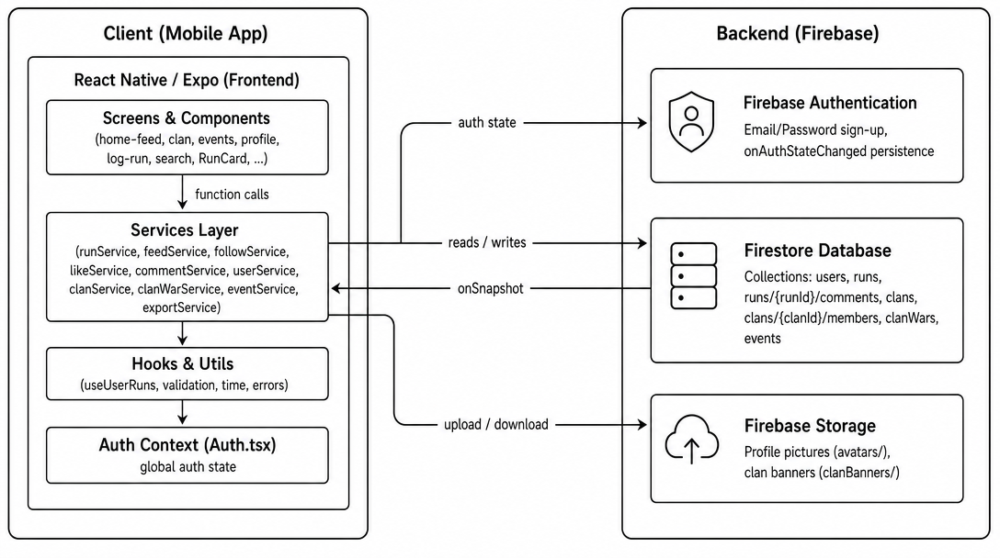

# Run Don't Walk

<p align="center"></p>

**Making running a team sport.**

A social running app built with React Native, TypeScript, and Firebase. Log runs, follow friends, join clans, compete in 2-week clan wars, and show up for group runs.

Built with [Dylan Ho](https://github.com/holyd28) for NUS Orbital 2026 and awarded the **Apollo 11** tier, the second-highest of four achievement levels.

## Features

**Core**

- User authentication with persistent sessions (Firebase Auth)
- Manual run logging with pace calculation and workout types
- Social feed with real-time updates (Firestore `onSnapshot`)
- Friend / follow system with user search
- Likes and comments on runs

**Extensions**

- Run statistics dashboard with Victory Native charts (weekly/monthly distances, workout-type breakdown, personal records)
- Clan management with a 4-tier role system (Leader, Co-Leader, Moderator, Member) enforced at the service and UI layers
- 2-week clan wars: cumulative-distance competitions with live scoreboards and top-contributor leaderboards
- Group run events by Singapore region (Central / North / South / East / West) with transactional RSVP
- CSV export of run history via the native share sheet

## Architecture

The app follows a service-layer architecture: screens own UI state only, all Firestore reads and writes go through typed service modules, and real-time updates stream down via `onSnapshot` listeners. No state-management library was needed; a single auth context covers session state (YAGNI).

<p align="center"></p>

- [Navigation flow](docs/diagrams/navigation.png)
- [Firestore data model](docs/diagrams/firestore-model.png)

## Testing

- **256 Jest unit tests** across 16 suites, **82.6% line coverage** (100% on core service files like feed, like, and comment services)
- 47 manual end-to-end system tests covering auth, clans, wars, events, and CSV export on physical devices
- Structured user testing with 6 external testers in the target demographic: think-aloud task sessions plus a 1–5 survey (overall satisfaction 4.2). Fixes from testing included RSVP double-tap protection, CSV null-field handling, and clan-name length validation

## Try it

**Android**

Download the APK from [Google Drive](https://drive.google.com/file/d/1WZRZLwdK8qNWUCon1IVuxl7U_WAxmKx2/view?usp=sharing), transfer it to your phone, allow unknown-app installs, and open it.

## Setup for development

```bash
git clone https://github.com/jarenyap/run-dont-walk.git
cd run-dont-walk
npm install
cp .env.example .env   # fill in Firebase credentials
npx expo start         # scan QR with Expo Go
```

## Engineering practices

- Three-tier branching: `main` (stable) → `dev` (integration) → `feature/*`, all merges via reviewed pull requests
- Conventional commits, GitHub Issues tracked on a Projects board, 2-week sprints
- ESLint + Prettier enforced; Firebase config only via environment variables (never committed)

## Built with

TypeScript · React Native · Expo (SDK 54) · Firebase (Auth, Firestore, Storage) · Jest · Victory Native · Git & GitHub
